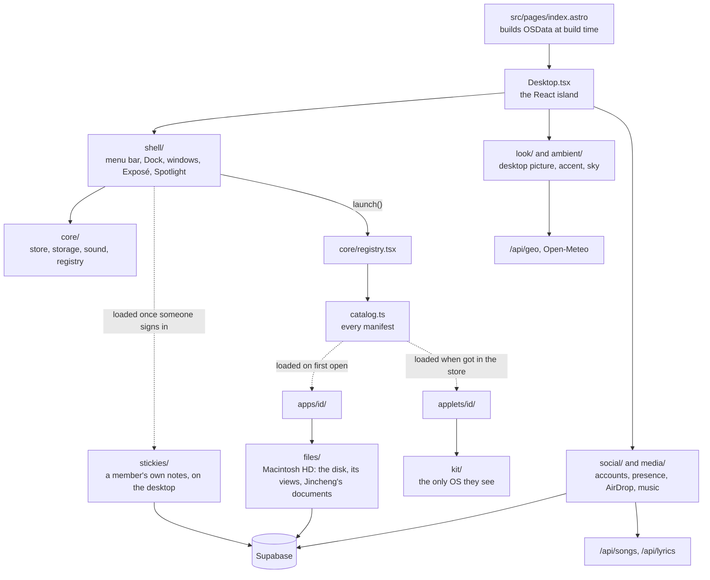

# The desktop

How JM/OS is put together: the map, the boundaries, where things go and
the shell every app shares. Read this before changing anything under
`src/os/`. Each app's own behaviour is in its component's header comment;
music and lyrics are in [media.md](media.md); accounts, chat and
presence in [supabase.md](supabase.md).

The home page (`src/pages/index.astro`) is JM/OS, a Mac OS X–style
desktop rendered by one client-only React island in `src/os/`. The page
also renders a visually hidden plain-text copy of the content for screen
readers, crawlers and visitors without JavaScript.

## How it fits together

The dotted lines are the only way into apps and applets: the OS reaches
them through the catalog, apps don't import each other, and applets see
only `kit/`. The lint enforces all three, on `import()` as well as import
declarations (a local rule in `eslint.config.js`), and over every folder
of `src/os/` but `apps/`, `applets/` and the catalog, so a new folder is
guarded from its first file. `core/` is the base layer, so it may import
types from the domain folders but no values (the catalog and
`kit/manifest` aside): nothing of a domain reaches the first load by way
of `core/`. `tests/eslint.test.ts` probes each rule.

## Where new code goes

The folders of `src/os/` are layers or domains. The layers are `core/`
(the store, storage, sound, the registry: what every part uses),
`shell/` (the chrome round the windows), `kit/` (what applets see) and
`styles/`; the domains are what the desktop is about: `files/`
(Macintosh HD), `media/`, `social/`, `stickies/`, `look/` and
`ambient/`.

- Code two apps share goes into its domain, never into `core/` because
  it's shared: Macintosh HD's model is `files/disk.ts`, which Finder,
  Time Machine, the Terminal and AirDrop use.
- A domain may use the layers and other domains; `core/` imports values
  from no domain (the lint refuses it).
- A new top-level folder is only for a new domain. Anything else goes
  into the folder of the domain it belongs to, or into the app's own
  folder while only that app uses it.

## Where things are

| Folder in `src/os/` | Holds | Start from |
| --- | --- | --- |
| `core/` | the store, types, registry, icons, sounds, storage | `store.ts`, `registry.tsx`, `storage.ts` |
| `shell/` | the menu bar, Dock, windows and the rest of the chrome | `Window.tsx`, `MenuBar.tsx`, `Dock.tsx` |
| `look/` | desktop pictures and the accent colour | `wallpapers.ts`, `accent.ts` |
| `ambient/` | the visitor's place, weather and sky | `place.ts`, `Sky.tsx` |
| `media/` | music, lyrics, listening along | see [media.md](media.md) |
| `social/` | Supabase: accounts, presence, chat, AirDrop | see [supabase.md](supabase.md) |
| `files/` | Macintosh HD: the disk, the views and folders Finder and Time Machine share, and Jincheng's home folder (the documents and the diary, from the database) | `disk.ts`, `parts.tsx`, `home.tsx`, `documents.ts` |
| `stickies/` | a member's own stickies, on their desktop and in Stickies › Yours | `mine.ts`, `DesktopStickies.tsx` |
| `apps/` | the built-in apps, one folder each | `<id>/manifest.ts` |
| `applets/` | the Applet Store's games and tools | `<id>/manifest.ts` |
| `kit/` | everything applets may use | `index.ts` |
| `styles/` | the Aqua theme the first paint needs, by part of the desktop | `os.css` imports them |

## Naming

- A file that exports one React component is named after it, in
  PascalCase: `Window.tsx`, `DayFinder.tsx`. Its name says what it is
  across the whole desktop, not only in its folder: Time Machine's
  read-only Finder is `DayFinder.tsx`, not `Browser.tsx`, since the
  Browser is an app.
- Logic, hooks and a set of small components are camelCase: `store.ts`,
  `useKeys.ts`, `dockDrag.tsx`, `parts.tsx`. A test sits beside what it
  tests as `<name>.test.ts` (or `.tsx`), a Web Worker as
  `<name>.worker.ts`.
- Folders are lowercase; an app's or applet's is its id
  (`apps/timemachine/`, `applets/tilegame/`).
- Stylesheets are kebab-case (`source-list.css`, `own-stickies.css`),
  except one that belongs to a single module, which takes its name
  (`media/discArt.css`). A new app's stylesheet is `<id>.css`; some older
  ones use the display name (`about-mac.css`, `applet-store.css`,
  `photo-booth.css`, `tile-game.css`, the iPod's `styles.css`) and stay.
- Every class is prefixed `os-` and then the part or app it belongs to
  (`os-dock-label`, `os-finder-cf-item`), so nothing collides with the
  rest of the site, another app or a third party. Keys remembered in the
  browser start with `os-` too (`core/storage.ts`), but for `theme`,
  which the classic site shared.

## Apps and applets

- `src/os/catalog.ts` lists every app's manifest (`apps/<id>/manifest.ts`
  or `applets/<id>/manifest.ts`: name, the day it came, icon, window
  size, where it appears, and how to load it); `AppId` is derived from it.
  `src/os/core/registry.tsx` turns the manifests into what the OS uses,
  with each app's component loaded lazily, and `launch()` opens one. `dockApps` and `mobileDockApps` pick what
  the Dock keeps (other apps appear there while open, except `noDock`
  panels); `launcherApps` is what Spotlight lists. `dockApps` is only
  the default: on desktops the visitor rearranges the Dock
  (`core/dock.ts`, kept in `os-dock`): dragging an icon along it moves
  it, off it removes it (in a puff), and in from Finder's Applications
  or Applets (Finder puts the app id on the drag as `APP_MIME`), or a
  running app's slot dragged left, keeps it. The Dock menu has Keep in
  Dock and Remove from Dock; Finder stays first; System Preferences ›
  Dock restores the default. Phones keep `mobileDockApps`. The drag
  itself is `shell/dockDrag.tsx`, fetched once the desktop has settled
  or on the first press (it isn't in the first load); it writes
  `shell/dockDragState.ts` and the Dock draws it. Every slot opens and
  closes on one spring (`SLIDE` in `Dock.tsx`): a gap where a drop would
  land, a dragged or leaving app's slot closing, an arriving one
  opening, so a slot closing while another opens keeps the Dock still.
  A drop lands in one step (`instant`), with the dragged icon kept over
  its place until the slot shows. With motion reduced, slots jump. Keep the Dock and the
  desktop (`shell/DesktopIcons.tsx`: Macintosh HD, About Me, Résumé,
  Projects) short, and nothing is added to them, not even a disc in DVD
  Player's drive ([0021](../decisions/0021-nothing-is-added-to-the-desktop.md)); a phone's home screen lists every app.
- `src/os/apps/`: one folder per built-in app. Content comes from `OSData`,
  assembled at build time in `index.astro` from `src/content/site.ts`, the
  projects collection and `src/lib/photos.ts` (Unsplash, fetched at build).
- Applets are self-contained: each is a folder under `applets/` that
  imports only `src/os/kit` and its own files, never the rest of the OS or
  another applet (the lint enforces it). The kit gives them sounds, the
  sound setting, whether their window is in front, a game loop that stops
  when it isn't (`useGameLoop`), storage under their own `os-<id>` keys
  (`saved`, whose `update` builds on what's stored and `watch` hears the
  visitor's other tabs), a way to resize their window and the photo
  library. Anything new an applet needs from the OS is added to the kit,
  not imported around it.
- `src/os/core/applets.ts` and `apps/appstore/`: the Applet Store
  (Minesweeper, Tile Game, Calculator, Spider Solitaire, Pinball, Synth;
  each store page is the `applet` field of the applet's manifest). Which
  applets this browser has installed is kept in `os-applets`; installed
  applets appear in Finder's Applets folder and Spotlight. Getting one
  downloads its code and styles then (not before; `perf` checks none is
  in the first load), and it's listed only once they've arrived; a failed
  download leaves it uninstalled with a notification. An applet that
  isn't installed, asked for by a link, the Terminal or anything else
  that calls `launch()`, opens its page in the store. Removing one closes
  its windows and keeps what it saved, as a Mac keeps an app's
  preferences. An app whose code has arrived renders directly rather than
  through `lazy` (`readyApp()` in the registry), so it opens at once. To
  add one, see [adding.md](adding.md).
- Each app's own behaviour (what it shows, its keys, what it keeps in
  the browser, Jincheng's decisions about it) is in the header comment of
  its component (`apps/<id>/<Name>.tsx`, `applets/<id>/<Name>.tsx`) and
  of the modules beside it, not here: read it before changing the app,
  and keep it current there. This file has only what apps share.

## Windows and the shell

- `src/os/core/store.ts`: zustand store for windows (map + z-order array),
  theme and appearance, Spotlight, Dashboard, Exposé, the screensaver
  and its settings, the visitor's place and the chosen desktop picture.
- Open windows survive a reload (`src/os/core/windowSession.ts`, saved in
  `os-windows`); `openSession()` puts them back and then opens what a
  `?open=` link names on top of them, once: `open` leaves the address as
  it's handled (`history.replaceState` in `core/deepLink.ts`), so a reload
  brings the session back, the link's target among it, rather than the
  target alone (#189). With neither a session nor a link, a first visit
  gets the Welcome window alone, centred (`os-welcomed`); otherwise the
  desktop starts clear. Nothing opens About by itself.
- The browser's size is the store's `viewport` (`watchViewport()` in
  `core/store.ts`, started by `Desktop.tsx`). A resize or a rotation
  fits every window to it once per animation frame, however many events
  arrive in one (`fitToViewport`, which `restoreWindows` uses too, so a
  reload and a resize agree): a window keeps its size where it still
  fits, shrinks where it doesn't, and is pulled back so its title bar is
  in reach (`fitWindow`); one that fits keeps its object, so it doesn't
  render again. Zoomed windows and a phone's apps take their frame from
  `viewport` (`zoomedFrame`, `phoneFrame`) and are the only windows that
  select it; unzooming returns to the saved size, fitted. Exposé lays
  out again while it's open, and a member's stickies are kept within
  reach (below). It's the browser's inner size (`innerWidth` ×
  `innerHeight`), never `visualViewport`: a phone's keyboard or a pinch
  zoom changes only the visual viewport and leaves the apps alone
  (#192).
- `src/os/shell/Expose.tsx`: the Exposé overlay (F9, the bottom-left hot
  corner or View → Exposé); the grid itself is `exposeLayout.ts`, a
  plain module with a test, laid out for the browser's size and again
  when it changes (`WindowLayer` in `Desktop.tsx`). Windows animate to
  their slot in place, so iframes don't reload. While it's open it has
  the keys, before any window (Escape leaves it and does nothing else;
  F9 and ⌘ keys are the desktop's).
- `src/os/shell/AppSwitcher.tsx`: ⌥Tab steps through open windows, most
  recent first; releasing ⌥ focuses the chosen one.
- `src/os/core/useKeys.ts`: whose a key is. A handler on `window`
  (`useKeys`; Finder's, the iPod's centre key, Time Machine's Finder,
  Job Hunt's, iCal's, TextEdit's, Stickies', an alert's, the Burn
  sheet's) listens only while its window is in front
  (`useFocusedId() === win.id`) and takes a key only when `ownsKey(e)`
  says it's the app's: an unmodified key with focus on the page itself
  or anywhere in the window (a panel the app draws outside it, DVD
  Player's Controller, counts as inside by its `data-panel`), never on a
  control elsewhere, which keeps its own Return, Space and arrows: a
  Dock icon, the menu bar and its menus, a window's close box (the title
  bar is the shell's), another window. ⌘ and ⌥ shortcuts are the front
  app's wherever focus is, as menu commands are, except in a text field,
  where only ⌘ gets through: ⌥ with a key types a character there
  (`typing(e)`, which the desktop's ⌥W, ⌥M and ⌥T in
  `shell/useShortcuts.ts` check as well). Applets get `ownsKey` from the
  kit (Pinball). Exposé, the ⌥Tab switcher and a full-screen app's own
  keys (Time Machine's Escape and Page Up/Down) hold theirs wherever
  focus is, and an Escape closes Quick Look before it leaves Time
  Machine.
- `src/os/core/focus.ts`: where focus goes back to when something that
  took it closes. Spotlight, the Dashboard and a full-screen app note
  what had focus in the store's action that opens them (`setSpotlight`,
  `setDashboard`, `openFullScreen`), before anything of theirs mounts,
  and their layers call `releaseFocus()` as they close; an alert and a
  context menu note it as they render. It comes back a frame later
  (after the key that closed it has been handled everywhere, so no app
  takes that key too), and only if focus is on the page itself or still
  in what closed: focus put somewhere else meanwhile stays. When what
  had it is gone or hidden, or a window came to the front meanwhile (a
  Spotlight result, a menu command, Time Machine's Restore opened one),
  it goes to the window in front: a window takes focus itself
  (`tabIndex={-1}`, found by its `data-id`). A window closed or
  minimized with focus in it (its close box, ⌥W, File › Close Window)
  hands focus to the next one in front the same way (`close` and
  `minimize` in the store).
- `src/os/shell/Dashboard.tsx`: the Dashboard covers the desktop, so
  unlike a window it's modal (`aria-modal`): what's under it, and the
  page around the desktop, is `inert` while it's up, focus moves onto it
  as it opens (Tab goes on to its widgets) and comes back as it closes
  (`core/focus.ts`). Escape or a click on the dimmed desktop closes it.
- A full-screen app (the manifest's `fullScreen`: Time Machine) has no
  window: `shell/FullScreenLayer.tsx` draws it over the windows, the
  menu bar and the Dock, which are `inert` under it (the page around the
  desktop too: `inertAround` in `core/focus.ts`), and the desktop's
  shortcuts, the ⌥Tab switcher and Exposé's corner stay quiet
  (`useFocusedId()` is null meanwhile, so no window has the keys).
- `src/os/shell/drawer.tsx`: Tiger-style drawers. Each window has a slot
  along its edge (right, left if there's no room, or over the content
  when neither side fits); an app renders `<Drawer open>` anywhere and it
  appears there. Used by Photos (Info) and Finder (Get Info, ⌥I).
- `src/os/shell/genie.ts`: the displacement map behind the Genie minimize
  in `Window.tsx`.
- `src/os/core/notices.ts` and `shell/Notices.tsx`: Growl-style
  notifications (chat mentions, AirDrop offers). `shell/ContextMenu.tsx`
  is the right-click menu the desktop, the Dock, Finder, Stickies and
  iCal share. Shift+F10 or the context-menu key opens the focused
  thing's (`openContextMenu` in `shell/menuKeys.ts`, from
  `useShortcuts`: the same `contextmenu` event a right-click sends, from
  the middle of what has focus, so every place with a menu has it; on
  the page itself with no window in front, the desktop's; a text field
  keeps the browser's). Focus goes into the menu as it opens: its first
  item when the keyboard opened it, the menu itself when the pointer
  did, so ↓ starts at the top. ↑ ↓ Home and End move through what can
  be chosen (`menuStep`, as the menu bar's arrows go round); Escape and
  Tab close it and give focus back to what opened it, as a command does
  unless it put focus somewhere itself. The desktop icons have no menu
  of their own.
- The menu bar's menus after File come from the front window: the iPod
  and Karaoke's Controls, and any app's own, which it sets with
  `setMenus(win.id, menus)` in the store while it's open (Chess's Game
  menu, DVD Player's Controls). Phones show only the Apple menu, so what's in an app's menus
  needs a way in from its window too.
- The menu bar is see-through. Its text is white or black depending on
  how bright the top of the desktop picture is (`topBrightness()` in
  `accent.ts`, darkened by the sky's layers via `skyDimming()`), shown as
  `data-backdrop` on `.os-root`. It turns opaque over a zoomed window and
  on phones while an app is open. The Apple logo is tinted with the
  accent.
- `src/os/shell/DesktopLyrics.tsx`: the playing song's lyrics floating
  over the desktop, when the visitor turns them on; see
  [media.md](media.md).
- `src/os/shell/Screensaver.tsx` and `savers.tsx`: Desktop Pictures (a
  slideshow of Mac OS X's scenic desktop pictures, `SCENIC` in
  `look/pictureSets.ts`), Flurry, iTunes Artwork, Soapbox (the latest posts in
  large type), Starfield, Clock or Bounce, after the idle time chosen in
  System Preferences (two minutes by default). The views and their list
  (`SAVER_STYLES`) are in `saverViews.tsx`, off the first load.
  iTunes Artwork is Leopard's: the music library's covers on a wall of
  square tiles (album covers and songs' own; a song without art has
  none), each dealt once before any repeats and never beside itself,
  one tile turning over every 2.5 s to a cover the wall shows least
  (`artwork.ts`, with tests). The next cover is fetched before it
  turns, a broken one is dropped, and nothing turns while the page is
  hidden. The preview in System Preferences is the same wall in
  miniature (columns follow the screen's width). With motion reduced, a
  cover fades into the next in place. Its stylesheet, `artwork.css`,
  arrives as text with the view, like an app's.
- Phones are anything narrower than 768px or a short touch screen (a phone
  sideways): `isPhone()` and `PHONE_QUERY` in `src/os/core/store.ts`, and
  the same media query in the stylesheets. The store's `phone` says the
  same as of the last change of the viewport, for what renders by it
  (`Window`), so a window follows a browser that crosses the line.

## System Preferences, sound and settings

- Settings are chosen in System Preferences (`apps/preferences/`, which
  lists the keys each pane keeps) and live in the browser, most in
  `os-system` (`src/os/core/system.ts`). Animations ask
  `useReduceMotion()` there rather than motion's `useReducedMotion()`, so
  the Displays pane's choice wins over the device's.
- `src/os/core/sound.ts`: interface sounds synthesized with Web Audio (no
  recordings). Off by default; the menu bar speaker and the Sound pane
  turn them on (`os-sound` in `localStorage`). That one switch and volume
  govern every sound, the music included: anything new that plays audio
  must follow it (see `setLoudness()` in `music.ts`).

## Desktop picture, accent and sky

- `src/os/look/wallpapers.ts`: desktop pictures besides photos: ryOS's
  tiles (`public/os/wallpapers/tiles`, listed in
  `src/data/wallpaper-tiles.json`), solid colours, SVG/CSS patterns and a
  dynamic sky that follows the sun and weather at the visitor's place.
  The store keeps a photo URL or `color:<id>`, `pattern:<id>`,
  `dynamic:sky`; `backgroundFor()` turns it into CSS.
- `src/os/look/pictureSets.ts`: ryOS's photo collections
  (`public/os/wallpapers/photos`, listed in `src/data/wallpapers.json`;
  WebP, at most 2560px wide), stored as a photo's URL. Only choosing a
  picture needs the list, so it's off the first load: Preferences, the
  screen saver and the change below load it.
- The desktop picture changes to another from the same collection each
  time the visitor leaves the tab and comes back (`useDesktopPicture.ts`,
  `nextPicture()` in `pictureSets.ts`, loaded as the tab is left); the
  default moves on to `SCENIC`.
  A checkbox in System Preferences turns it off. Jincheng's own photos
  are only shown in Photos, never as the desktop or the screen saver.
- `src/os/look/accent.ts`: the accent colour. By default it's sampled from
  the desktop picture (the most prominent colourful hue, at a readable
  lightness); System Preferences can fix it instead. Everything blue in
  `os.css` derives from `--os-accent` via `color-mix()`. The sampled
  accent and the top's brightness (the menu bar's text) are cached for
  the last dozen pictures (`os-accent-cache`, `os-brightness-cache`), a
  Photo Booth picture's data URL by its hash rather than as itself.
- `src/os/ambient/place.ts`: where the visitor is. `api/geo.ts` (a Vercel
  Function) returns the city, coordinates and time zone Vercel derives
  from their IP address; the Weather widget's flip side lets them pick a
  city instead (kept in `localStorage`), and `?place=<city>` overrides
  both for demos. Without a location (e.g. `astro dev`) it falls back to
  San Jose's weather and the device clock.
- `src/os/ambient/Sky.tsx` and `weather.ts`: tint the wallpaper with the
  time of day and weather at that place (Open-Meteo), in °F or °C by
  country. `?sky=dusk,rain` pins both. The menu bar clock and the
  Dashboard's clock and calendar use the place's time zone; a Dashboard
  widget shows Jincheng's time in San Jose next to it.

## Files and sharing

- `src/os/files/disk.ts`: Macintosh HD, a read-only file system built
  from the content (Applications, Applets, Documents, Movies, Music,
  Pictures, Projects), which Finder (`apps/finder/`), Time Machine and
  the Terminal browse. A file's `look` is what Quick Look shows (a
  picture, or a `View` of its own), `openLabel` its button ("Play DVD"),
  `trash` what Move to Trash (⌘⌫) does and `share: false` keeps it from
  AirDrop. Movies is DVD Player's shelf: Finder builds it
  (`files/movies.tsx` from `media/discs.ts`) and hands it to
  `buildDisk`, so the desktop's own copy of the disk (AirDrop's, in the
  first load) has no Movies and none of its code.
- What Time Machine shows as well lives in `files/`: a file's picture
  with the locked badge, the date and path helpers (`parts.tsx`), Quick
  Look, the Movies and Users folders, and their styles (`files.css`,
  which `finder.css` and `timemachine.css` import).
- Users › jincheng is Jincheng's home folder (`files/home.tsx`,
  handed to `buildDisk` as Movies is, and first in the sidebar with the
  house FileVault puts on a locked home): Desktop, Documents, Downloads,
  Library, Movies, Music, Pictures, Public and Sites. To anyone but the
  owner every folder but Public and Sites is `locked`: it wears Mac OS
  X's red "no access" badge (drawn in `Thumb`, so every view has it) and
  opening it, from any view, the sidebar or a path, brings up Finder's
  alert ("The folder … could not be opened because you do not have
  sufficient access privileges."). A Finder window that comes back or
  opens at such a place, or goes Back to one, shows the folder above it
  with the same alert (`lockedOn` in `parts.tsx`), once it's known
  whether this is the owner. Signed in as the owner, they open and
  hold Jincheng's documents, and Documents holds the diary, a year to a
  document ("Diary 2026.rtf"). Public holds what Jincheng lets everyone
  read; Sites, the projects' live sites as Internet locations that open
  in the Browser. The documents come from the database (`files/documents.ts`,
  [supabase.md](supabase.md)), which gives anyone else only Public's,
  read when a folder under Users shows (at most every 30 s, again when
  the tab comes back, and at once when another tab of the owner's saves
  or deletes something: `useHomeRefresh`, told over the `os-home`
  BroadcastChannel, as stickies and iCal are; a tab showing nothing of
  the home reads again the next time it does). Move to Trash on one of
  the owner's documents asks first ("will be deleted immediately"),
  since there's no Trash to take it back from.
- `src/os/shell/Alert.tsx` (with `alert.css`, which an app's stylesheet
  imports): an app's alert as Tiger drew one, the app's icon beside the
  message, with OK, Cancel and a third choice, Return and Escape. It
  takes the keys only while its window is in front: one that comes up
  behind (a save refused after the window was left) waits, and Return
  typed in another window stays that window's, as Return on a control
  outside the window (a Dock icon) stays that control's (`ownsKey` in
  `core/useKeys.ts`).
- `src/os/social/airdrop.ts` and `apps/airdrop/`: AirDrop between
  signed-in members on the desktop (signed out, it asks you to sign in).
  Only a Macintosh HD path is sent, and the receiver looks it up on its
  own disk, so only JM/OS's own content can arrive; offers go over
  presence signals and must be accepted. Finder (right-click, drag onto
  AirDrop), Photos and project windows share.

## Social

- `src/os/apps/ical/`: iCal, in Applications: a member's own days and
  to-dos, which only they see (`calendar.ts`; the tables in
  [supabase.md](supabase.md)); signed out, it says how to have some.
  Tiger's brushed metal round the calendars (Home and Work, each shown or
  hidden on this device, and a little month under them), the month
  (six weeks from the Sunday on or before its first day; a day lists
  three events and "more…") and To Do. A double-click on a day makes an
  event there, all day, its title chosen to be typed over in the info
  drawer (`EventInfo.tsx`: title, all day or from and to, the day, the
  calendar, notes); File › New Event (⌥N) and New To Do (⌥K) as ⌘N and ⌘K
  were. To-dos tick off, rename with a click, and take their priority,
  when they're due and their calendar from a right-click
  (`Todos.tsx`). The arrow keys move the day chosen; Delete deletes its
  event, asked first. Events are read six weeks at a time as the month
  moves, to-dos whole; the member's other tabs read again on every
  change. Narrow (a phone), it shows the month or To Do, chosen at the
  top.
- `src/os/stickies/`: a member's own stickies (`mine.ts`, the table in
  [supabase.md](supabase.md)). Signed in, a member's notes sit on their
  own desktop (`DesktopStickies.tsx`, drawn by `shell/DesktopStickiesLayer.tsx`,
  whose code comes only once someone signs in, so none of it is in the
  first load), above its icons and below every window, each where it
  was left (shown within reach of a smaller browser, `onScreen` in
  `mine.ts`, without moving it: nothing is written on a resize, and the
  place it was left stands for the screen it was left on): held by its
  strip to move it, by the corner to size it,
  rolled up with a double-click on the strip (Tiger's window shade), a
  right-click for its colour, and the close box to take it down (asked
  first if there's anything on it). What's typed saves once the typing
  rests (`core/useAutosave.ts`, shared with TextEdit) and is kept as a
  draft until it has; a save from an older copy asks Use That or Keep
  This. The member's other tabs read them again on every change
  (`BroadcastChannel`), and another account never sees them, even for a
  moment. New Sticky Note on the desktop's right-click menu puts one
  where it was clicked; Stickies › Yours lists them as cards, with File ›
  New Sticky (⌥N), and is where they live on a phone, which has no
  desktop for them. From either, the new note takes the caret once it's
  on screen. Font: Marker Felt, where the device has it.
- `src/os/social/social.ts`: Stickies (a guestbook) and presence (who's
  online and from which city, and, for a visitor who turns them on in
  System Preferences › Sharing, other visitors' pointers labelled with
  it) on Supabase. Other people's pointers are off by default: nobody's
  pointer crosses another screen uninvited. See [supabase.md](supabase.md).

## Styles and assets

- `src/os/os.css`: the Aqua theme the first paint needs, split by part
  of the desktop into `src/os/styles/` and imported in cascade order: the
  shell, and what several apps share (`components.css`,
  `source-list.css` for the Finder-style sidebar). CSS that only lazily
  loaded code uses sits beside that code and arrives with it, after all
  of these: an app's in its folder, the Dashboard's and the screen
  saver's in `shell/` (where it goes: [adding.md](adding.md)).
- Icons, fonts and the wallpaper under `public/os/` and `src/assets/os/`
  come from ryOS; see `NOTICE`. They stay
  ([decision 0001](../decisions/0001-keep-the-retro-assets.md)); icons
  for apps ryOS doesn't have are drawn in `core/icons.tsx` to match.

## Links and the tab title

- Deep links: `/?open=<app|project-slug|dashboard|screensaver>` opens that
  window over the saved session, once; the address loses `open` (and a
  reset link's token) as it's handled, so a reload doesn't open it again
  (`core/deepLink.ts`). An applet not installed opens its store page, and
  Time Machine takes the screen, as from anywhere else (`launch()`).
- `/profile` is the link to share: a temporary redirect in `vercel.json`
  to `/?open=about`, the About Me window
  ([0023](../decisions/0023-about-me-is-the-profile.md)).
- The home page's browser tab says "Jincheng" (`tabTitle` in
  `Layout.astro`); link previews keep the full title.
- There's no Chinese site any more: `/zh/*` redirects to the English
  paths (`vercel.json`), so old links still land. The last version with
  it is the `zh-archive` tag
  ([decision 0010](../decisions/0010-chinese-on-hold.md)).
